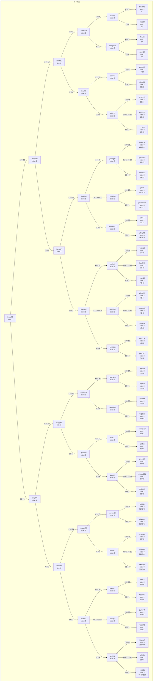
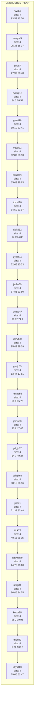

```mermaid
graph TD
subgraph B+TREE
thsza99[thsza99<br/>size: 2<br/>]
zhndk44[zhndk44<br/>size: 2<br/>]
smfif21[smfif21<br/>size: 2<br/>]
acnnv10[acnnv10<br/>size: 2<br/>]
bxmrd4[bxmrd4<br/>size: 2<br/>]
bmqbh2[bmqbh2<br/>size: 2<br/>1 2 ]
bxmrd4-->|x <= 2|bmqbh2
nfsiz89[nfsiz89<br/>size: 2<br/>3 4 ]
bxmrd4-->|2 < x|nfsiz89
acnnv10-->|x <= 4|bxmrd4
eemyo95[eemyo95<br/>size: 2<br/>]
lfvrv36[lfvrv36<br/>size: 2<br/>5 6 ]
eemyo95-->|x <= 6|lfvrv36
ddnrf94[ddnrf94<br/>size: 2<br/>7 8 ]
eemyo95-->|6 < x|ddnrf94
acnnv10-->|4 < x|eemyo95
smfif21-->|x <= 8|acnnv10
lipan96[lipan96<br/>size: 2<br/>]
furny77[furny77<br/>size: 2<br/>]
zppos66[zppos66<br/>size: 2<br/>9 10 ]
furny77-->|x <= 10|zppos66
gimki76[gimki76<br/>size: 2<br/>11 12 ]
furny77-->|10 < x|gimki76
lipan96-->|x <= 12|furny77
fixcs37[fixcs37<br/>size: 3<br/>]
srsgm13[srsgm13<br/>size: 2<br/>13 14 ]
fixcs37-->|x <= 14|srsgm13
qbrcy33[qbrcy33<br/>size: 2<br/>15 16 ]
fixcs37-->|14 < x <= 16|qbrcy33
tccyr70[tccyr70<br/>size: 2<br/>17 18 ]
fixcs37-->|16 < x|tccyr70
lipan96-->|12 < x|fixcs37
smfif21-->|8 < x|lipan96
zhndk44-->|x <= 18|smfif21
ktvrx97[ktvrx97<br/>size: 2<br/>]
mfecr38[mfecr38<br/>size: 3<br/>]
jnpmg25[jnpmg25<br/>size: 3<br/>]
vyank24[vyank24<br/>size: 3<br/>19 20 21 ]
jnpmg25-->|x <= 21|vyank24
gmcbp45[gmcbp45<br/>size: 2<br/>22 23 ]
jnpmg25-->|21 < x <= 23|gmcbp45
qfesq93[qfesq93<br/>size: 2<br/>24 25 ]
jnpmg25-->|23 < x|qfesq93
mfecr38-->|x <= 25|jnpmg25
zvgwr46[zvgwr46<br/>size: 2<br/>]
lycke6[lycke6<br/>size: 3<br/>26 27 28 ]
zvgwr46-->|x <= 28|lycke6
pmmww27[pmmww27<br/>size: 3<br/>29 30 31 ]
zvgwr46-->|28 < x|pmmww27
mfecr38-->|25 < x <= 31|zvgwr46
mmuuw73[mmuuw73<br/>size: 2<br/>]
siify54[siify54<br/>size: 2<br/>32 33 ]
mmuuw73-->|x <= 33|siify54
pbrgr72[pbrgr72<br/>size: 3<br/>34 35 36 ]
mmuuw73-->|33 < x|pbrgr72
mfecr38-->|31 < x|mmuuw73
ktvrx97-->|x <= 36|mfecr38
blkpg59[blkpg59<br/>size: 3<br/>]
pmfzq9[pmfzq9<br/>size: 3<br/>]
wxxxc8[wxxxc8<br/>size: 2<br/>37 38 ]
pmfzq9-->|x <= 38|wxxxc8
kbodv90[kbodv90<br/>size: 2<br/>39 40 ]
pmfzq9-->|38 < x <= 40|kbodv90
yrsmj18[yrsmj18<br/>size: 2<br/>41 42 ]
pmfzq9-->|40 < x|yrsmj18
blkpg59-->|x <= 42|pmfzq9
hvcnb58[hvcnb58<br/>size: 3<br/>]
whmti53[whmti53<br/>size: 2<br/>43 44 ]
hvcnb58-->|x <= 44|whmti53
mwzwz57[mwzwz57<br/>size: 2<br/>45 46 ]
hvcnb58-->|44 < x <= 46|mwzwz57
dfglw104[dfglw104<br/>size: 2<br/>47 48 ]
hvcnb58-->|46 < x|dfglw104
blkpg59-->|42 < x <= 48|hvcnb58
zrfwl103[zrfwl103<br/>size: 2<br/>]
ywppr74[ywppr74<br/>size: 2<br/>49 50 ]
zrfwl103-->|x <= 50|ywppr74
pklfk102[pklfk102<br/>size: 2<br/>51 52 ]
zrfwl103-->|50 < x|pklfk102
blkpg59-->|48 < x|zrfwl103
ktvrx97-->|36 < x|blkpg59
zhndk44-->|18 < x|ktvrx97
thsza99-->|x <= 52|zhndk44
hvgpl98[hvgpl98<br/>size: 2<br/>]
ucgtg43[ucgtg43<br/>size: 2<br/>]
mbqxi20[mbqxi20<br/>size: 2<br/>]
yeaqk19[yeaqk19<br/>size: 2<br/>]
pbkdv3[pbkdv3<br/>size: 2<br/>53 54 ]
yeaqk19-->|x <= 54|pbkdv3
crptr68[crptr68<br/>size: 2<br/>55 56 ]
yeaqk19-->|54 < x|crptr68
mbqxi20-->|x <= 56|yeaqk19
ekhay85[ekhay85<br/>size: 2<br/>]
tptse84[tptse84<br/>size: 2<br/>57 58 ]
ekhay85-->|x <= 58|tptse84
ougqj30[ougqj30<br/>size: 2<br/>59 60 ]
ekhay85-->|58 < x|ougqj30
mbqxi20-->|56 < x|ekhay85
ucgtg43-->|x <= 60|mbqxi20
gwlch86[gwlch86<br/>size: 2<br/>]
rbxin31[rbxin31<br/>size: 2<br/>]
wnmev17[wnmev17<br/>size: 2<br/>61 62 ]
rbxin31-->|x <= 62|wnmev17
lsfnf64[lsfnf64<br/>size: 2<br/>63 64 ]
rbxin31-->|62 < x|lsfnf64
gwlch86-->|x <= 64|rbxin31
iqqtf65[iqqtf65<br/>size: 3<br/>]
zhhzg29[zhhzg29<br/>size: 2<br/>65 66 ]
iqqtf65-->|x <= 66|zhhzg29
mcbzd101[mcbzd101<br/>size: 2<br/>67 68 ]
iqqtf65-->|66 < x <= 68|mcbzd101
gcdpb35[gcdpb35<br/>size: 2<br/>69 70 ]
iqqtf65-->|68 < x|gcdpb35
gwlch86-->|64 < x|iqqtf65
ucgtg43-->|60 < x|gwlch86
hvgpl98-->|x <= 70|ucgtg43
oralx87[oralx87<br/>size: 2<br/>]
aeyvw42[aeyvw42<br/>size: 2<br/>]
nwosx15[nwosx15<br/>size: 2<br/>]
qchil11[qchil11<br/>size: 3<br/>71 72 73 ]
nwosx15-->|x <= 73|qchil11
ujpdp60[ujpdp60<br/>size: 3<br/>74 75 76 ]
nwosx15-->|73 < x|ujpdp60
aeyvw42-->|x <= 76|nwosx15
nldyu61[nldyu61<br/>size: 3<br/>]
uqvvu40[uqvvu40<br/>size: 2<br/>77 78 ]
nldyu61-->|x <= 78|uqvvu40
umvjb80[umvjb80<br/>size: 3<br/>79 80 81 ]
nldyu61-->|78 < x <= 81|umvjb80
hkapf49[hkapf49<br/>size: 3<br/>82 83 84 ]
nldyu61-->|81 < x|hkapf49
aeyvw42-->|76 < x|nldyu61
oralx87-->|x <= 84|aeyvw42
hloan62[hloan62<br/>size: 3<br/>]
obwtt41[obwtt41<br/>size: 2<br/>]
ielfb14[ielfb14<br/>size: 2<br/>85 86 ]
obwtt41-->|x <= 86|ielfb14
hosvz82[hosvz82<br/>size: 2<br/>87 88 ]
obwtt41-->|86 < x|hosvz82
hloan62-->|x <= 88|obwtt41
aatsq83[aatsq83<br/>size: 2<br/>]
pylow48[pylow48<br/>size: 2<br/>89 90 ]
aatsq83-->|x <= 90|pylow48
vdzpj78[vdzpj78<br/>size: 2<br/>91 92 ]
aatsq83-->|90 < x|vdzpj78
hloan62-->|88 < x <= 92|aatsq83
xcffz52[xcffz52<br/>size: 3<br/>]
mayyg23[mayyg23<br/>size: 3<br/>93 94 95 ]
xcffz52-->|x <= 95|mayyg23
wfibi51[wfibi51<br/>size: 2<br/>96 97 ]
xcffz52-->|95 < x <= 97|wfibi51
thfck91[thfck91<br/>size: 3<br/>98 99 100 ]
xcffz52-->|97 < x|thfck91
hloan62-->|92 < x|xcffz52
oralx87-->|84 < x|hloan62
hvgpl98-->|70 < x|oralx87
thsza99-->|52 < x|hvgpl98
end
```

```mermaid
graph LR
subgraph UNORDERED_HEAP
nwlrb1[nwlrb1<br/>size: 4<br/>93 52 12 70 ]
nmqhe5[nmqhe5<br/>size: 4<br/>25 36 18 37 ]
nwlrb1-->nmqhe5
zlnvq7[zlnvq7<br/>size: 4<br/>27 99 68 40 ]
nmqhe5-->zlnvq7
nvmqf12[nvmqf12<br/>size: 4<br/>84 3 76 57 ]
zlnvq7-->nvmqf12
gvzvi16[gvzvi16<br/>size: 4<br/>60 19 33 41 ]
nvmqf12-->gvzvi16
cqcel22[cqcel22<br/>size: 4<br/>92 87 58 13 ]
gvzvi16-->cqcel22
bahsa26[bahsa26<br/>size: 4<br/>15 43 28 63 ]
cqcel22-->bahsa26
tbmvf28[tbmvf28<br/>size: 4<br/>64 59 31 97 ]
bahsa26-->tbmvf28
djokd32[djokd32<br/>size: 4<br/>14 69 4 88 ]
tbmvf28-->djokd32
pybbt34[pybbt34<br/>size: 4<br/>72 65 10 23 ]
djokd32-->pybbt34
jsubx39[jsubx39<br/>size: 4<br/>67 81 21 80 ]
pybbt34-->jsubx39
cnuyg47[cnuyg47<br/>size: 4<br/>90 82 74 1 ]
jsubx39-->cnuyg47
jomyt50[jomyt50<br/>size: 4<br/>95 42 89 29 ]
cnuyg47-->jomyt50
gmijc55[gmijc55<br/>size: 4<br/>53 44 17 61 ]
jomyt50-->gmijc55
nssas56[nssas56<br/>size: 4<br/>50 8 85 73 ]
gmijc55-->nssas56
jomik63[jomik63<br/>size: 4<br/>30 62 7 46 ]
nssas56-->jomik63
gdgjb67[gdgjb67<br/>size: 4<br/>54 77 9 34 ]
jomik63-->gdgjb67
cchqk69[cchqk69<br/>size: 4<br/>38 16 26 56 ]
gdgjb67-->cchqk69
jjicc71[jjicc71<br/>size: 4<br/>71 32 83 48 ]
cchqk69-->jjicc71
ittpk75[ittpk75<br/>size: 4<br/>49 11 91 35 ]
jjicc71-->ittpk75
qdwmx79[qdwmx79<br/>size: 4<br/>24 75 78 20 ]
ittpk75-->qdwmx79
ntxgi81[ntxgi81<br/>size: 4<br/>86 45 94 55 ]
qdwmx79-->ntxgi81
kuocr88[kuocr88<br/>size: 4<br/>98 2 39 96 ]
ntxgi81-->kuocr88
djiqn92[djiqn92<br/>size: 4<br/>5 22 100 6 ]
kuocr88-->djiqn92
ldfyu100[ldfyu100<br/>size: 4<br/>79 66 51 47 ]
djiqn92-->ldfyu100
end
```
